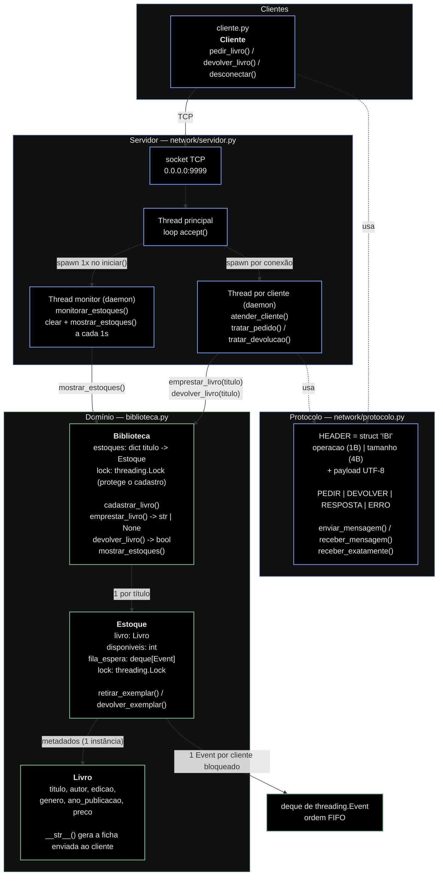
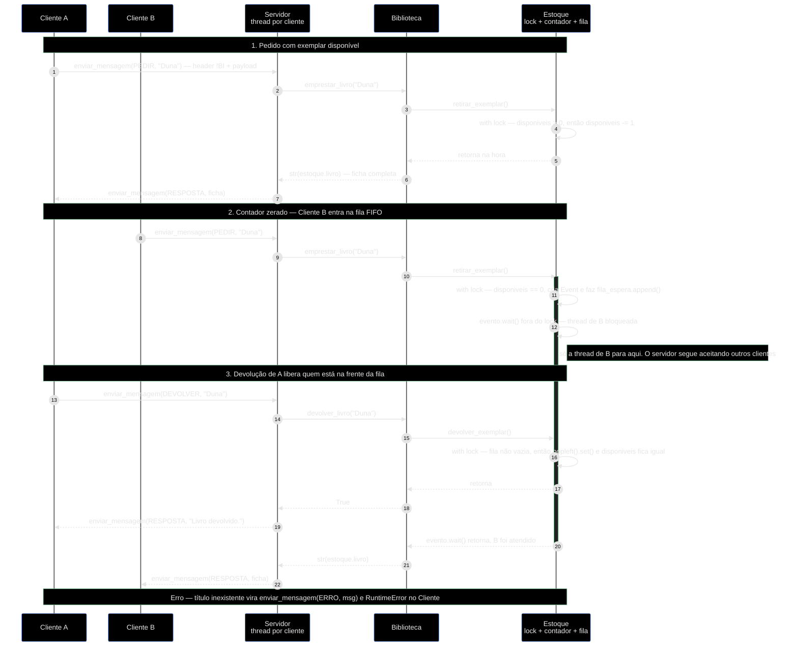

# Arquitetura

Biblioteca concorrente com servidor TCP multithread. O domínio (`biblioteca.py`)
não conhece rede; a camada de rede (`network/`) apenas traduz bytes em chamadas
de domínio.

O controle de concorrência é feito por **contador + fila de eventos**: cada
`Estoque` guarda quantos exemplares estão livres (`disponiveis: int`) e uma fila
FIFO de `threading.Event`, um por cliente bloqueado. Não existe objeto por
exemplar — o que circula pela rede é a ficha do livro (`str(Livro)`).

## Diagrama de componentes

## Fluxo de dados

Pedido atendido na hora, pedido que cai na fila de espera, e a devolução que
desbloqueia quem estava esperando.

## Ponto de atenção

- **`devolver_livro` não confere posse.** A devolução é feita só pelo título
  (`Servidor.tratar_devolucao`), sem registro de quem pegou o quê. Um cliente
  pode devolver um título que nunca pediu e inflar `disponiveis` acima da
  capacidade — não há teto em `Estoque.devolver_exemplar()`.